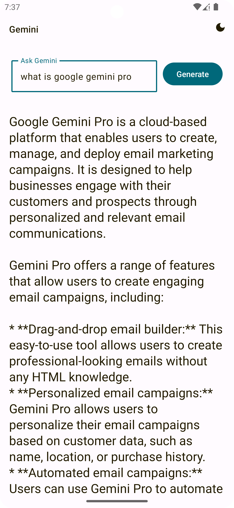

# Playing with KMM

Simple KMM app implementing Google's Gemini Pro.

### Supported Platforms: 
* Android
* iOS
* Desktop
* Browser

 

 

 

## What's Google Gemini KMP?
Google Gemini KMP is a Kotlin Multiplatform Mobile project that brings the power of Kotlin to both Android and iOS platforms. It's designed to demonstrate the versatility and efficiency of Kotlin Multiplatform, allowing you to write shared code for both platforms without sacrificing the native experience.
